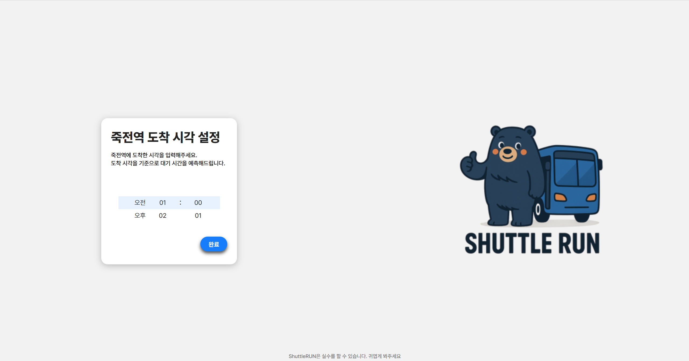

# 🚌 ShuttleRun: 단국대 셔틀버스 ETA 예측 시스템

단국대학교에서 운행하는 셔틀버스는 출발 시간만 정해져 있고, 도착 시간은 실시간 교통 상황에 따라 달라집니다.  
ShuttleRun은 사용자가 원하는 도착 시간을 입력하면, 실시간 교통 정보를 기반으로 셔틀버스의 예상 위치와 도착까지 남은 시간을 시각적으로 제공합니다.

---

## 🔍 주요 기능

1. **도착 시간 기반 셔틀 위치 예측**
   - 사용자가 도착하고자 하는 시간을 입력하면, 해당 시간에 셔틀버스가 어디쯤에 있을지를 예측합니다.
2. **실시간 교통 정보 활용**
   - NAVER Directions5 API와 Geocode API를 활용하여 실시간 교통 상황을 반영한 경로 및 소요 시간을 계산합니다.
3. **시각적 정보 제공**
   - 예상 도착 시간까지 남은 시간을 텍스트로 표시하고, 지도상에 셔틀버스의 예상 위치를 마커로 표시합니다.

---

## 🖥️ 데모 화면

> 아래는 ShuttleRun의 주요 화면 예시입니다.

  
*사용자가 "셔틀 찾기" 버튼을 클릭하여 도착 시간을 설정하는 화면*

  
*사용자가 도착 시간을 입력하는 화면*

  
*예상 셔틀버스 위치와 도착까지 남은 시간을 지도와 함께 표시하는 화면*

---

## ⚙️ 기술 스택

| 분야         | 기술 스택                                       |
|--------------|------------------------------------------------|
| 프론트엔드   | HTML, CSS, JavaScript, Leaflet.js              |
| 백엔드       | Python, Flask                                  |
| 외부 API     | NAVER Directions5 API, NAVER Geocode API       |
| 지도 시각화  | OpenStreetMap, Leaflet.js                      |

---

## 🧑‍💻 팀원 소개

| 이름     | 역할             | 주요 업무                                      |
|----------|------------------|-----------------------------------------------|
| 안재민   | 팀장, 프론트엔드 | 지도 시각화, UI/UX 설계                       |
| 언도윤   | 백엔드           | ETA 계산 로직, API 서버 개발                  |
| 지현구   | 문서화, 관리     | 프로젝트 기획서 작성, README 및 문서 관리     |

---

## 📂 프로젝트 구조

```
OpenSourceSW_Team13/
├── backend/                 # Flask 기반 백엔드 서버
│   ├── app.py               # 메인 애플리케이션 파일
│   └── utils.py             # ETA 계산 및 API 호출 유틸리티
├── frontend/                # 프론트엔드 정적 파일
│   ├── index.html           # 메인 페이지
│   ├── styles.css           # 스타일시트
│   └── script.js            # 프론트엔드 로직
├── doc/                     # 문서 및 이미지 자료
│   └── images/              # README에 사용된 이미지
├── schedule.json            # 셔틀버스 출발 시간표
└── README.md                # 프로젝트 설명서
```

---

## 🚀 실행 방법

### 1. 저장소 클론

```bash
git clone https://github.com/NotJaem/OpenSourceSW_Team13.git
cd OpenSourceSW_Team13
```

### 2. 가상 환경 설정 (선택 사항)

```bash
python -m venv venv
source venv/bin/activate  # Windows의 경우: venv\Scripts\activate
```

### 3. 필수 패키지 설치

```bash
pip install -r requirements.txt
```

### 4. 환경 변수 설정

NAVER API를 사용하기 위해 아래 환경 변수를 설정해야 합니다.

```bash
export NAVER_CLIENT_ID=your_client_id
export NAVER_CLIENT_SECRET=your_client_secret
```

Windows의 경우:

```cmd
set NAVER_CLIENT_ID=your_client_id
set NAVER_CLIENT_SECRET=your_client_secret
```

### 5. 백엔드 서버 실행

```bash
cd backend
python app.py
```

### 6. 프론트엔드 실행

브라우저에서 `frontend/index.html` 파일을 열어 실행합니다.

---

## 📌 주의 사항

- NAVER API의 사용량 제한에 유의하세요.
- 실시간 교통 정보는 NAVER Directions5 API의 응답에 따라 달라질 수 있습니다.
- 셔틀버스의 실제 도착 시간은 예측값과 차이가 있을 수 있습니다.

---

## 📄 라이선스

이 프로젝트는 MIT 라이선스를 따릅니다. 자세한 내용은 [LICENSE](./LICENSE)를 참고하세요.

---

더 자세한 내용은 [프로젝트 저장소](https://github.com/NotJaem/OpenSourceSW_Team13)를 참고해주세요.
